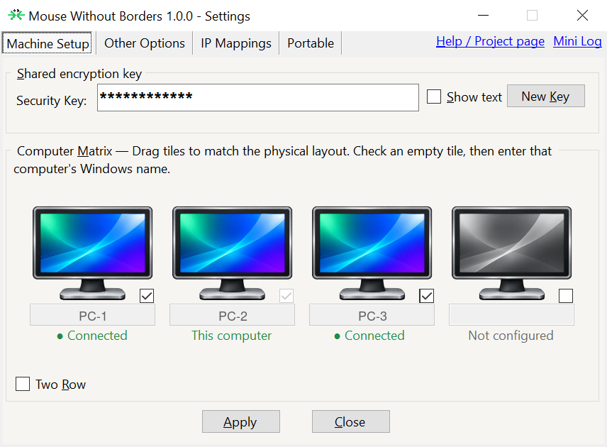
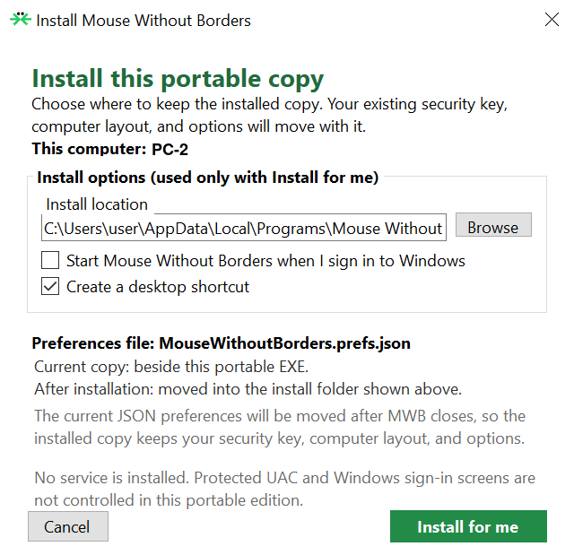

  

<h1 align="center">Mouse Without Borders — Portable</h1>

  <strong>Modern Mouse Without Borders, separated from PowerToys and packaged as one portable Windows EXE.</strong> 
  Vibe-coded with ChatGPT from Microsoft's open-source implementation.

  <a href="https://github.com/aeae1/MouseWithoutBorders-Portable/releases/latest">Download the latest stable release</a>
  ·
  <a href="https://github.com/aeae1/MouseWithoutBorders-Portable/actions/workflows/build.yml">Windows build status</a>

## A much better file-transfer experience

**[Version 1.1.0 is now stable](https://github.com/aeae1/MouseWithoutBorders-Portable/releases/tag/mwb-v1.1.0).** The new drag-and-drop system goes well beyond the original file-copy feature.

- **Drag files and whole folders between PCs**, with clear file-type previews, directly into an open Explorer folder or your chosen receiving folder.
- **See what's happening:** one transfer window with individual progress bars, overall speed and estimated time remaining.
- **Stay in control:** reorder queued work, pause, resume, retry or cancel individual files and folder groups.
- **Recover interrupted transfers** using checked, saved progress.
- **Keep existing files safe:** matching names get separate copies instead of overwriting your originals.

[File-transfer guide](docs/FILE_TRANSFERS.md) · [What's new in 1.1.0](docs/RELEASE_1.1.0.md)

## What this project is

Share one mouse and keyboard across up to four Windows PCs, without installing or running PowerToys. This unofficial fork keeps the maintained PowerToys-era Mouse Without Borders engine and packages it as a focused portable application.

- One self-contained `MouseWithoutBorders.exe`.
- Preferences in `MouseWithoutBorders.prefs.json` beside the EXE, with separate recovery metadata for unfinished transfers.
- Run from your chosen folder or use the optional per-user installation.
- No Windows service, required PowerToys installation, or telemetry.
- Recognizable green branding, compact settings, and a simple tray menu.

## Screenshots

  
   
  <strong>Machine Setup.</strong> Arrange up to four PCs to match the physical desk layout, with each computer's connection state visible at a glance.

  
   
  <strong>Optional portable installation.</strong> Move the current security key, computer layout, and preferences into a per-user installation—without installing a Windows service.

## Everyday controls

- **Machine Setup:** arrange your PCs and choose one or two rows to match your desk.
- **Other Options:** mouse switching, clipboard sharing, file transfers, receiving-folder choice, automatic transfer-window closing, and optional keyboard shortcuts. Hover over an option for its explanation and initial value.
- **IP Mappings:** a large multiline editor with visible connection-help instructions for PCs that need a manually specified address.
- **Installation:** install a portable copy, manage Start with Windows, open the app folder, or uninstall an installed copy.
- **Mini Log:** a reusable diagnostic window with an explicit Copy all button and a bounded recent-event history.
- **About:** manually check for updates and open GitHub to download them. Updates are never installed automatically.

The tray contains Settings, File transfers, About, and Exit. Service-only settings and optional clipboard/network status popups are removed. The tray icon stays plain.

## Download and run

1. [Download the latest stable EXE](https://github.com/aeae1/MouseWithoutBorders-Portable/releases/latest/download/MouseWithoutBorders.exe).
2. Put it in a folder where you want to keep it, then run it.
3. Choose **Run portable here**, or **Install for me** and select an install folder. Installation offers a desktop shortcut and optional Start with Windows.
4. Use the same release on every connected PC and configure the same shared key.

Already using this fork? Finish or cancel active transfers, exit MWB, and replace the existing EXE while keeping the adjacent preferences and recovery files. For an installed copy, the new EXE's **Install for me** flow can update the same installation and relaunch it. A portable copy can also install later through Settings → **Installation**. See the [1.1.0 upgrade notes](docs/RELEASE_1.1.0.md#upgrading).

> [!NOTE]
> **Why is the EXE roughly 88 MB (about 84 MiB)?** It is a self-contained .NET 10 Windows build. The EXE bundles the .NET runtime, Windows Forms desktop assemblies, and required native runtime components, so the destination PC does not need a separate .NET installation. Most of the download size is this bundled platform.

## Compatibility and limitations

- The published download is for Windows x64. Use the same fork release on all connected PCs for the complete file-transfer feature set.
- This edition supports normal interactive desktops. It does not install a service or control protected UAC prompts and the Windows sign-in screen.
- Clipboard file copy/paste retains its separate transport; the transfer window and recovery controls described above apply to drag-and-drop.
- Busy Wi-Fi can still affect mouse responsiveness during full-speed copying.
- Builds are unsigned and may trigger Windows SmartScreen. The release workflow publishes the EXE only after its source builds, tests, and package checks pass.

The fork accepts user-chosen shared keys of at least four characters and generates twelve-character random keys. Short keys are easier to guess; keys do not expire or trigger periodic regeneration prompts. Microsoft's upstream work and encryption implementation remain credited in the source.

## Release status

**1.1.0** promotes the tested RC14 application code, with version and documentation updates. It brings the new transfer system, revised settings, and installer fixes into the stable release and `main` branch. The owner tested the RC series on real PCs and reported no major bugs in recent use; that does not mean every hardware or network edge case has been exercised.

GitHub Actions builds Windows Release x64, runs the unit suite, checks the EXE version and single-file package, and publishes an accompanying SHA-256 checksum. Version 1.0.0 and the RC source tags remain available as earlier recovery points.

## Documentation

- [What's new in 1.1.0 and upgrading](docs/RELEASE_1.1.0.md)
- [File transfers, queue controls, and recovery](docs/FILE_TRANSFERS.md)
- [Detailed extraction and product status](docs/README.md)
- [Development and compatibility guide](docs/DEVELOPMENT.md)
- [Upstream synchronization record](docs/UPSTREAM_SYNC.md)
- [AI-assistance disclosure](docs/AI_ASSISTANCE.md)
- [Contributing](CONTRIBUTING.md) · [Security policy](SECURITY.md) · [Code of Conduct](CODE_OF_CONDUCT.md)

## License and attribution

Derived from Microsoft PowerToys Mouse Without Borders and distributed under the [MIT License](LICENSE). Microsoft and the original Mouse Without Borders/PowerToys contributors retain attribution for their upstream work. The upstream [third-party notices](NOTICE.md) are retained.

The portable extraction and fork-specific changes are developed for repository owner `aeae1` through ChatGPT coding sessions. This project is not affiliated with or endorsed by Microsoft.

Technical extraction history — the original 1.0 release

This historical record describes the initial portable extraction. Later settings and transfer changes are covered by the current guides above.

## Technical extraction history

This section records how the PowerToys module became this portable product. It is intentionally more detailed than the user guide so future maintainers can tell which pieces are essential and which are temporary scaffolding.

1. **Established a recoverable upstream baseline.** The work began from Microsoft PowerToys commit `becc96f59cf18f3128fedbd6856a5248104216dd`. Audited upstream commit identifiers remain recorded in the repository, while the portable product lives directly on `main`; the internal `STANDALONE` build symbol remains a technical identifier even though the product is presented as **Portable**.
2. **Mapped the behavior that had to survive.** Input capture/injection, the machine matrix, networking, encryption, clipboard sharing, file transfer, drag/drop, reconnect, and the clipboard-helper IPC path were treated as compatibility-sensitive. Service-only control of protected UAC and sign-in desktops was deliberately excluded because it conflicts with a one-EXE, no-admin product.
3. **Removed PowerToys project dependencies.** Direct dependencies on `PowerToys.Interop`, the native `PowerToys.GPOWrapper`, the full `Settings.UI.Library`, `ManagedCommon`, and PowerToys telemetry were replaced with small MWB-local compatibility implementations. The API shapes needed by imported MWB code were retained where that reduced risky churn; telemetry calls compile to a local no-op.
4. **Made the MWB directory build on its own.** During extraction, the portable app, tests, package versions, target framework settings, and output paths were first made self-contained under the MWB module directory. CI built an archive of only that directory, proving the product no longer needed the surrounding PowerToys source tree before the final cleanup occurred.
5. **Reduced the shipped product to one program.** The clipboard helper was folded into a hidden command-line mode of `MouseWithoutBorders.exe`, preserving the existing IPC design without distributing a companion helper. The release publish is self-contained and is checked to contain exactly one executable.
6. **Implemented adjacent portable preferences.** MWB settings are stored in `MouseWithoutBorders.prefs.json` beside the running EXE. Writes use a temporary file followed by replacement. Startup was reordered so the preferences singleton cannot silently create defaults before the user sees the first-launch choice—the cause of the original “process exists but no window or tray icon” failure.
7. **Built optional self-installation without an installer package.** First launch can run in place or copy the EXE into a per-user folder. Installation writes the prefs beside that EXE, creates a Start Menu shortcut, offers a desktop shortcut checked by default, and can add a current-user Start with Windows entry. No service, MSI, machine-wide registry registration, or administrator permission is added.
8. **Made portable-to-installed migration lossless.** A **Portable** tab in Settings can install an already-running configured copy. MWB first forces a synchronous preferences save, validates and copies the JSON with `appMode` changed to `Installed`, creates the selected shortcuts/startup entry, waits for the old process to exit, removes the old prefs, and launches the installed EXE. Invalid JSON aborts the migration without overwriting the destination or deleting the source.
9. **Simplified first connection setup.** The legacy blue setup wizard and its dead reconfigure link were removed from the portable flow. First run opens the classic matrix, shows the generated key, validates that checked computer names are nonblank and unique, and reports connection state on each configured tile in plain language.
10. **Adjusted key policy deliberately.** The fork accepts manually chosen keys of four or more characters and generates twelve-character keys from an easy-to-type alphabet using `RandomNumberGenerator`. The 31-character alphabet provides about 59.5 bits of entropy at that length. The modern PowerToys-era AES/PBKDF2 transport remains. Legacy timed enforcement that demanded an auto-generated key or warned that a key had expired is excluded from the portable build; keys change only when the user changes them.
11. **Restored a recognizable, exact icon.** `ClassicGreen.svg` reproduces the old 32×32 pixel grid exactly while mechanically mapping only the orange pixels to green. `ClassicGreen.ico` contains nearest-neighbor sizes from 16 through 256 pixels. The embedded icon is used by Explorer, title bars, and the tray, and the same SVG is displayed at the top of this page. A Test 5 experiment that simplified the smallest ICO frames was rejected because it lost part of the black pixel structure; Test 7 restores the complete pre-Test-5 artwork byte-for-byte.
12. **Added long-running and release safety rails.** The local diagnostic log rolls at 5 MB and retains only one previous file; there is no updater, survey, or telemetry sender. The fork audited PowerToys MWB through September 3, 2026 and ported Microsoft's September 2 transactional incoming-file protections. GitHub Actions builds, tests, checks the one-file package, computes a SHA-256 checksum, and creates test releases only after validation succeeds. Release-candidate publishing retains the two newest RC download pages and removes older RC release entries without deleting their source tags. Physical two-PC testing remains the final authority for input, clipboard, file transfer, sleep/wake, firewall, install, and uninstall behavior.
13. **Simplified the everyday interface.** The portable build's tray menu intentionally exposes only Settings, About, and Exit; installed copies additionally expose Start with Windows and Uninstall. Legacy screen-capture, broadcast-control, machine-switching, diagnostic, and dead help entries were removed from the visible menu without removing the underlying connection engine.
14. **Polished the portable presentation and build retention.** The portable About window overrides the legacy form's 90% opacity and renders fully opaque. Temporary CI executables are retained for one day—long enough for release publication and diagnosis—while durable downloadable builds remain attached to GitHub Releases.
15. **Fixed key application and made diagnostics inspectable.** Applying a typed security key now updates both the live encryption state and the adjacent preferences JSON, forces that save to finish before sockets reconnect, and compares keys with case-sensitive semantics. The **Mini Log** link opens a resizable/maximizable, modeless **Diagnostic Log** with selectable text and an explicit **Copy all** button. It combines the configuration/connection snapshot with version, mode, paths, environment, process, key-checksum, and a bounded recent-event tail; the actual key is redacted and the viewer warns that names, IPs, and paths may appear. It does not disable Settings, repeated clicks refresh the existing viewer, and the redundant modeless Close button was removed in favor of the normal window X. New preference files start with **Wrap mouse** off so an outer matrix edge does not unexpectedly jump to the opposite side; existing saved choices are not migrated or overwritten.
16. **Completed the repository cutover.** After Test 12 worked on real PCs, the portable source was promoted to the repository root. More than 8,500 unrelated PowerToys files were removed, leaving roughly 260 tracked files and about 3 MB of project content. Legacy PowerToys projects, the native module interface, service executable source, comparison-only project files, installers, build tooling, unrelated documentation, and unused legacy icon/manifest files were removed. The app project was renamed to `App/MouseWithoutBorders.csproj`, documentation moved to `docs`, and CI gained a repository-layout check that rejects the retired PowerToys paths if they return.
17. **Restored local shortcut ownership.** The inherited form still disabled its complete shortcut group with a stale tooltip claiming PowerToys Settings controlled it, while several letter-shortcut handlers were compiled out. RC3 removes that dependency assumption, reconnects the supported controls to the adjacent JSON settings, persists changes, hides three obsolete command rows, and makes every shortcut opt-in for newly created preferences.
18. **Repaired the Settings-to-install window ordering.** RC1 exposed a Windows z-order conflict: the modal installer disabled its Settings owner but could appear behind that owner's always-on-top window. The configured-copy installer now centers on its parent, stays above that topmost owner, and omits a redundant taskbar button. The true first-launch window retains its normal centered, taskbar-visible behavior.
19. **Made the reduced shortcut panel responsive.** After RC3 hid three obsolete PowerToys-era shortcut rows, their remaining controls were initially pinned near the panel's top edge while the panel itself continued to expand with Settings. RC4 lays out the four supported rows from the panel's current scaled dimensions, distributes them evenly, and caps their separation so both normal and maximized windows stay readable.
20. **Removed inaccessible grey-control explanations.** WinForms does not normally deliver hover events to disabled controls, so their tooltips could not explain why they were unavailable. RC5 hides the fully deprecated and disconnected **Use Key Mappings** switch, labels the two service-only sign-in options inline, and makes the disabled file-transfer label state its Share Clipboard dependency.
21. **Separated mouse-edge behavior from optional hotkeys.** RC6 moves Easy Mouse into Other Options as a plain screen-edge-switching checkbox while retaining Always, Hold Ctrl, and Hold Shift activation. Keyboard Shortcuts gains a persisted master switch that defaults off, gates both local and remotely processed assigned hotkeys, and preserves individual choices while inactive. The ambiguous per-row Disable wording becomes None, and the responsive panel is reorganized as a master row plus three assignment rows.
22. **Rebuilt the machine-tile artwork for modern displays.** RC7 replaces the 43×27 enabled/disabled monitor bitmaps that WinForms had to enlarge with 424×216 PNGs designed for the tile's native aspect ratio. The configured state combines a graphite-and-silver monitor with a restrained emerald, blue, cyan, and violet screen; the matching inactive state is grayscale. Machine naming, layout dragging, checkboxes, and status reporting are unchanged, and the accepted classic green EXE/tray icon remains untouched.
23. **Corrected machine-tile transparency and responsive layout.** RC8 replaces RC7's accidentally flattened white image backgrounds with true-alpha 360×288 PNGs, changes the image control from distortion-prone stretching to aspect-preserving zoom, and sizes each tile from the matrix's actual scaled bounds. One-row mode uses the otherwise available height, while two-row mode calculates both row heights and spacing so the lower monitors remain fully visible. The portable tile condenses its two rare split status phrases onto one line to leave more room for the art; machine order, state reporting, naming, connection behavior, and the classic green product icon are otherwise unchanged.

Current candidate: [1.1.1 RC3 smoother computer matrix](docs/RC_1.1.1_RC2.md).
